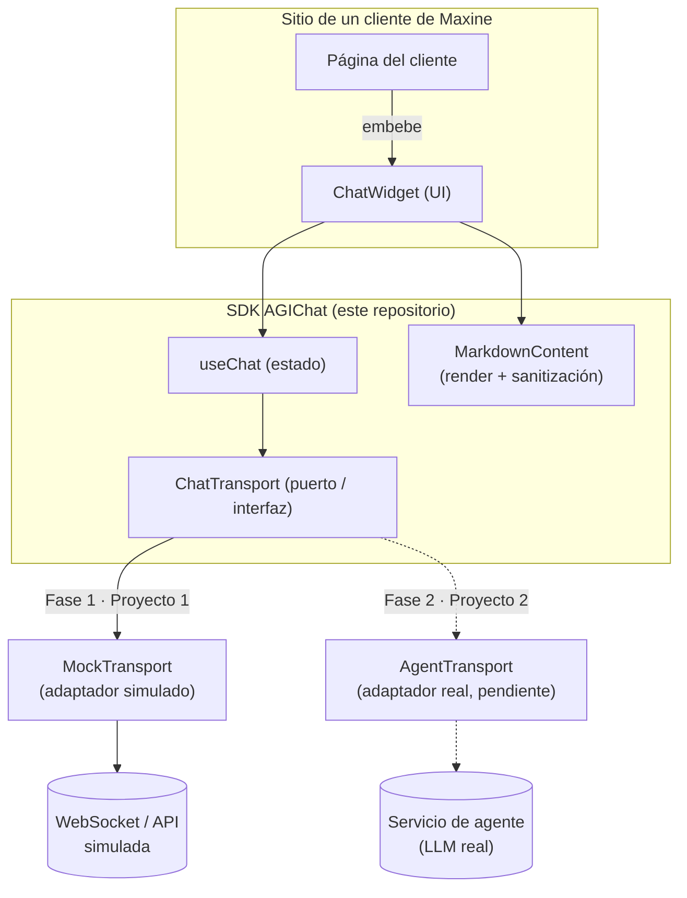

# Arquitectura del proyecto

## Decisión

Se utiliza una **arquitectura por capas con puertos y adaptadores (hexagonal)**, aplicada a un widget de chat construido en **React + TypeScript**, empaquetado como SDK con **Vite**.

La decisión central es que la interfaz de usuario **nunca conoce el origen real de los mensajes**. Toda la comunicación pasa por un puerto (`ChatTransport`), y las implementaciones concretas (mock hoy, agente real en el Proyecto 2) son adaptadores intercambiables detrás de ese puerto.

## Por qué esta arquitectura

- **Requisito explícito del proyecto**: la UI debe conectarse hoy a un mock y en la fase 2 debe poder cambiarse a un agente real "sin romper nada". El patrón adapter/hexagonal es la forma estándar de resolver justo ese problema: se cambia la implementación sin tocar el consumidor.
- **Trabajo en equipo (5 personas)**: al aislar la UI del transporte, distintas personas pueden trabajar en paralelo en componentes visuales, en el backend simulado y en la lógica de estado sin pisarse, siempre que respeten el contrato `ChatTransport`.
- **Testeable**: al ser una interfaz, es trivial reemplazar `MockTransport` por un doble de prueba en los tests, lo cual ayuda a alcanzar el 80% de cobertura exigido sin depender de red real.

## Diagrama de alto nivel

## Capas del código (`src/`)

| Capa | Carpeta | Responsabilidad | Depende de |
|------|---------|------------------|------------|
| UI | `components/` | Presentación pura (React) | `state/`, `markdown/` |
| Render de contenido | `markdown/` | Convertir Markdown del agente a HTML seguro (sanitizado) | — |
| Estado | `state/` | Traducir eventos del transporte a estado de React (`useChat`) | `transport/` |
| Transporte (puerto) | `transport/ChatTransport.ts` | Contrato que desacopla la UI del origen de datos | — |
| Transporte (adaptador) | `transport/mock/` | Implementación simulada para el Proyecto 1 | `ChatTransport` |
| Tipos | `types/` | Tipos compartidos entre todas las capas | — |

La regla que mantiene esto desacoplado: **nada en `components/` o `state/` importa `transport/mock` directamente**, salvo el punto de composición (`demo/`, o el consumidor final del SDK), que decide qué adaptador usar.

## Qué cambia en el Proyecto 2

Se agrega `transport/agent/AgentTransport.ts` implementando `ChatTransport` contra el agente real. `ChatWidget`, `useChat`, `MessageList`, `MessageBubble`, etc. no deberían requerir cambios.
